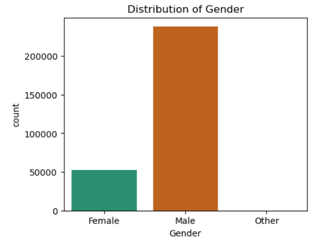
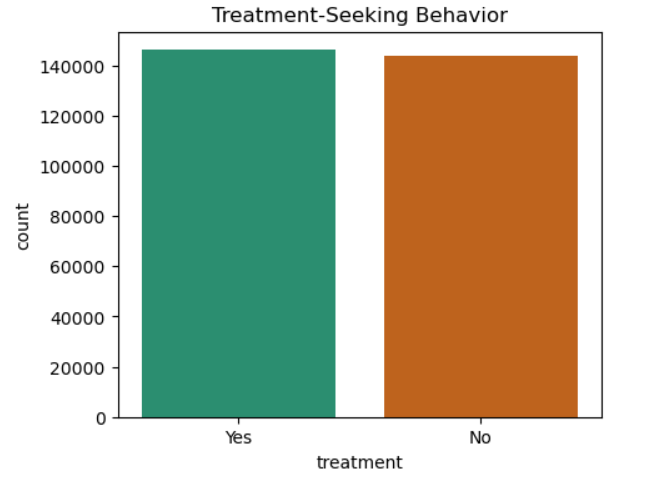
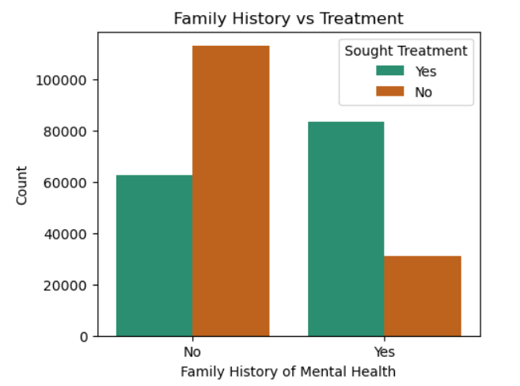
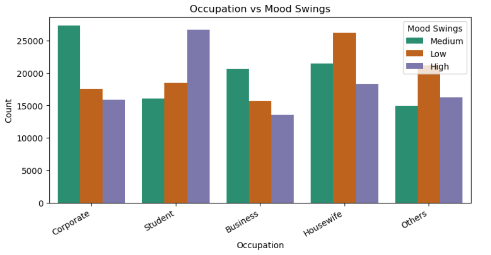
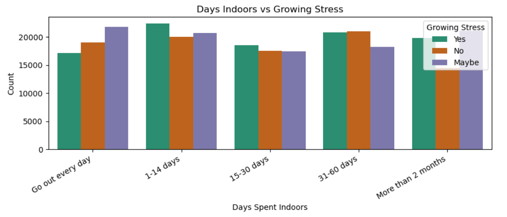

# 🧠 Mental Health in the Workplace – Exploratory Data Analysis

## 📌 Project Overview

This project explores a Mental Health Survey dataset using Exploratory Data Analysis (EDA) to identify patterns related to workplace mental health. The analysis focuses on understanding how demographic, occupational, lifestyle, and family-related factors influence stress levels and treatment-seeking behavior.

---

## 🎯 Objectives

* Explore the dataset and understand its structure.
* Clean and preprocess the data.
* Perform univariate, bivariate, and multivariate analysis.
* Identify factors associated with mental health treatment.
* Generate meaningful insights through data visualization.

---

## 📊 Dataset

* **Records:** 292,405
* **Features:** 17
* **Domain:** Mental Health

> **Note:** The dataset is not included in this repository due to its large size.

---

## 🧹 Data Preprocessing

* Removed duplicate records.
* Checked for missing values.
* Standardized inconsistent gender labels.
* Excluded the Timestamp column from the analysis.

---

## 📈 Analysis Performed

* Univariate Analysis
* Bivariate Analysis
* Multivariate Analysis
* Data Visualization

---

## 🔍 Key Insights

* Family history has a strong relationship with treatment-seeking behavior.
* Students show comparatively higher mood swings than other occupations.
* Occupation has less influence on treatment than family history.
* Mental health discussions remain uncomfortable across most respondents.
* Behavioral changes combined with family history provide better insight into stress levels.

---

## 🛠️ Technologies Used

* Python
* Pandas
* NumPy
* Matplotlib
* Seaborn
* Jupyter Notebook

---

## 📂 Repository Structure

```text
Mental-Health-EDA/
│
├── Mental_Health_EDA.ipynb
├── README.md
├── requirements.txt
└── images/
```

---

## 📷 Sample Visualizations













---

## 👩‍💻 Author

**Monika Gautam**


